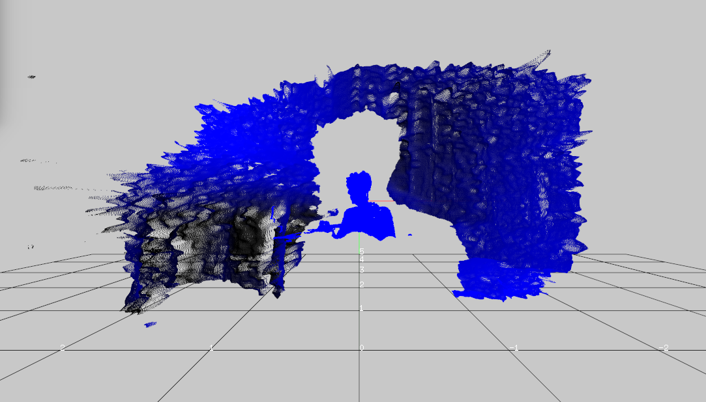

[](https://travis-ci.org/hiroMTB/ofxRealsense2)
[](https://ci.appveyor.com/project/hiroMTB/ofxrealsense2)

# ofxRealsense2 on Jetson Nano
This repos is openFrameworks addon for [Intel® RealSense™ SDK 2.0](https://github.com/IntelRealSense/librealsense). You can test your D400 series camera quickly. If you dont have device, you can still playback BAG files from [here](https://github.com/IntelRealSense/librealsense/blob/master/doc/sample-data.md) and see how it works (for example performance, postprocessing, depth quality, etc).


## Development period
- 2019.7

## Version
- Realsense 2.22.2
- libusb 1.0.22
- openFrameworks 0.10.0, 0.10.1

## TODO
- [x] OSX support
- [x] Windows support
- [x] Linux support (Jetson nano)
- [x] add ci scripts
- [ ] add postprocessing example
- [x] add bag file playback example

# Getting Started

## Install Openframeworks
Install [Openframeworks](https://openframeworks.cc/) on the Jetson Nano using this [gist](https://gist.github.com/jvcleave/e49c0b52085d040a5cd8a3385121cb91).

## Install Realsense SDK

Follow the [Jetson Hacks](https://www.jetsonhacks.com/) installation [here](https://github.com/JetsonHacksNano/installLibrealsense) and check you can launch realsense viewer, by tipping in the terminal :
```
realsense-viewer
```


### Copying the realsense pkg file
Run this line in the terminal to copy the pkg config file from the Jetson Hacks install to the pkg config location :
```
sudo mv /usr/local/lib/pkgconfig/realsense2.pc /usr/lib/pkgconfig/realsense2.pc
```
